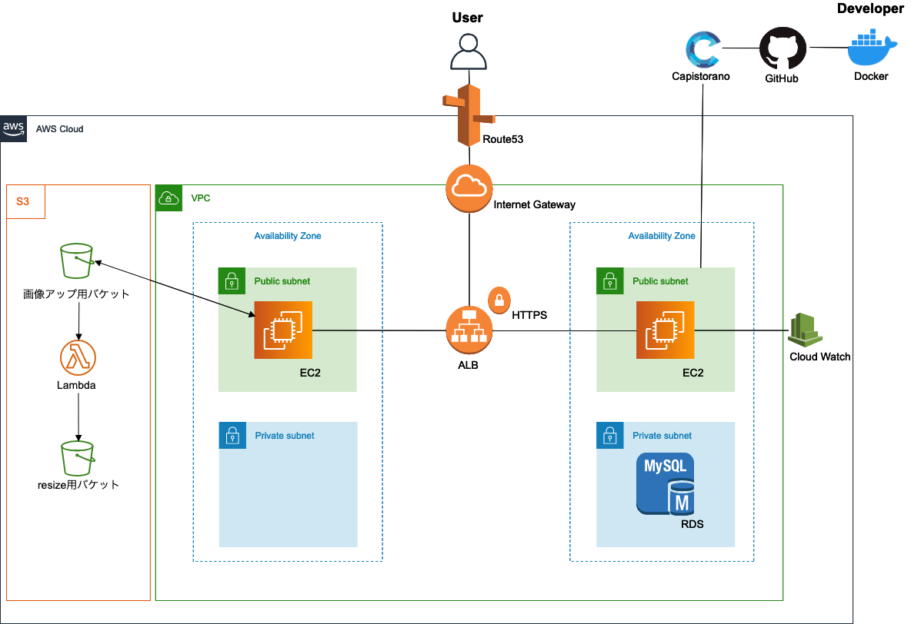

# README

 
## **サイト概要**

「もっとカジュアルにDIYを」 
DIYをする方に向けた、DIY特化型SNSサービスです。
 
 

## **URL**

https://diylog.work 
【ゲストログイン】ボタンからテストユーザーとしてログインできます。 
テストユーザーではユーザー編集以外の機能が使えます。
 
 

## **制作の背景**

1. 私の趣味であるDIYの素晴らしさを多くの人に知ってもらいたい。 
2. DIYのレシピサイト自体は存在するが、未経験者目線で見ると少し複雑でとっつきにくい 
上記２つの理由からこのサイトを制作することにしました。 
より手軽に閲覧でき、DIYの素晴らしさが伝わるようなサイトを目指しました。
 
 

## **ターゲットユーザー**

・レシピを参考にDIYをするユーザ 
・SNSとしてDIY好き同士で繋がりたいユーザー
 
 

## **主な利用シーン**

・DIYにチャレンジしたいとき 
・作ったレシピを共有したいとき
 
 

## **機能一覧**

+ guineapig
  + フォローされたとき、投稿にコメントされたとき、投稿がお気に入りされたときに通知が来る。
+ DM機能
  + ユーザー間でダイレクトメッセージを送ることができる。
+ ランキング表示機能
  + 投稿のお気に入り順に並び替えて表示できる。
+ N+1問題
+ HTTPS化
+ JSを用いてモーダル表示
+ レスポンシブ対応
 
 

詳細は下記よりご確認ください。
https://docs.google.com/spreadsheets/d/15X4uNo8008gP_WllnuBtxRkhUszWKZ5rvKUxfgOd8no/edit#gid=0
 
 

##  **開発環境**

### **フロントエンド**
+ Bootstrap 4.5.0
+ SCSS
+ JavaScript、jQuery、Ajax
 
 

### **バックエンド**
+ Ruby 2.5.7
* Rails 5.2.4.3
 
 

### **開発環境**
+ vagrant
+ MYSQL

### **本版環境**
+ AWS (EC2、RDS、Route53、CloudWatch、S3、Lambda、ALB)
+ MySQL2
+ Nginx、 Puma
+ Capistoranoを用いた自動デプロイ
 
 

### **インフラ構成図**
 
 
 

### **テスト**
+ Rspec（単体/結合） 計100以上
 
 

### **その他使用技術**
+ 非同期通信
+ HTTPS接続(certbot)
+ チーム開発を意識したGitHubの活用